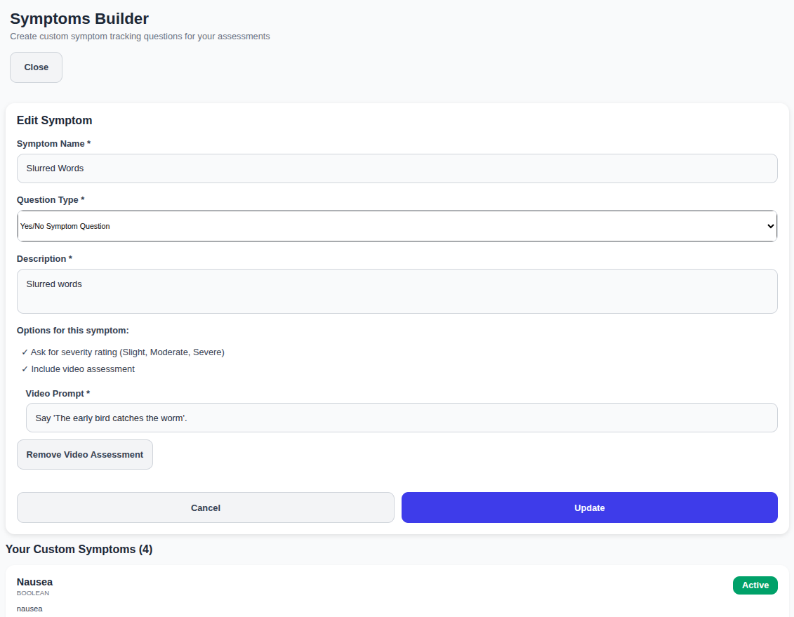

# ABStrack

## About ABStrack

This application is under heavy development. It is intended to be a tool to track the symptoms of a patient with [Autobrewery Syndrome](https://www.autobrewery.org/). There is a patient sign-in on the web to build a symptoms tracker, and a mobile phone app for the patient to track symptoms and BAC readings. There is a healthcare practitioner sign in to view reports.

The app will support the [BACtrack SDK](https://developer.bactrack.com/breathalyzer_sdk/documentation) so that the patient can connect to the [BACtrack Mobile](https://www.bactrack.ca/products/bactrack-mobile-smartphone-breathalyzer), [Mobile V2](https://www.bactrack.ca/products/bactrack-mobile-smartphone-breathalyzer), [C6](https://www.bactrack.ca/products/bactrack-c6-smartphone-keychain-breathalyzer), or [C8](https://www.bactrack.ca/products/bactrack-c8-breathalyzer) by bluetooth to take readings.

## Application Screenshots

