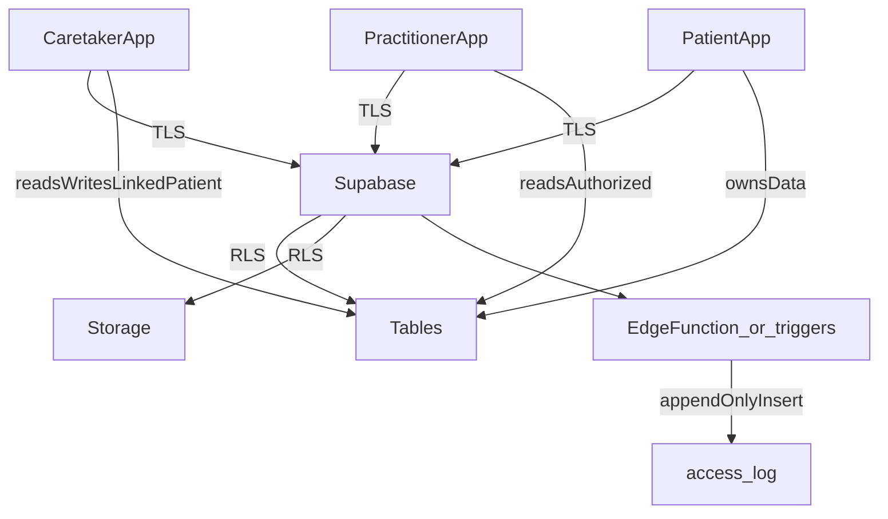

# ABStrack — Product Requirements Document

**Version:** 1.1  
**Author:** Sarah (NSCC SPRINT Scholar)  
**Status:** Draft  
**Last Updated:** March 2026

---

## Table of Contents

1. [Overview](#overview)
2. [Background & Problem Statement](#background--problem-statement)
3. [Goals & Non-Goals](#goals--non-goals)
4. [Users & Roles](#users--roles)
5. [Technical Stack](#technical-stack)
6. [Architecture Overview](#architecture-overview)
7. [Security, Privacy and Compliance](#security-privacy-and-compliance)
8. [Feature Requirements](#feature-requirements)
   - [Authentication](#1-authentication)
   - [Symptom Presets](#2-symptom-presets)
   - [Health Marker Presets](#3-health-marker-presets)
   - [Episode Logging](#4-episode-logging)
   - [General Wellness Logging](#5-general-wellness-logging)
   - [Food Diary](#6-food-diary)
   - [Caretaker Account](#7-caretaker-account)
   - [Healthcare Practitioner App](#8-healthcare-practitioner-app)
   - [Charts & Graphs](#9-charts--graphs)
   - [Video & Photo Capture](#10-video--photo-capture)
9. [MVP Scope](#mvp-scope)
10. [Post-MVP Roadmap](#post-mvp-roadmap)

---

## Overview

ABStrack is an open-source, privacy-first health tracking application for individuals living with **Auto-Brewery Syndrome (ABS)** — a rare and poorly understood condition in which endogenous ethanol is produced within the body, causing symptoms of intoxication without alcohol consumption. While fermentation of carbohydrates by gastrointestinal yeast or bacteria is the most commonly documented mechanism, ABS presentations vary significantly between individuals: some produce ethanol in the absence of carbohydrate consumption, and in rare cases fermentation has been documented outside the gastrointestinal tract entirely. The underlying mechanisms are not fully understood, triggers differ between patients, and the condition remains underdiagnosed and frequently dismissed by medical professionals.

The application consists of three sub-applications:

| App | Platform | Audience |
|---|---|---|
| User App | Mobile (React Native/Expo) + Web (Next.js) | Patients with ABS and their caretakers |
| Practitioner App | Web (Next.js) | Healthcare practitioners |

---

## Background & Problem Statement

ABS is a poorly understood and frequently misdiagnosed condition. Patients often experience episodes of intoxication-like symptoms — including cognitive impairment, slurred speech, vertigo, nausea, and some with neurological symptoms — without having consumed alcohol.

Documenting these episodes is critical for diagnosis, treatment, and ongoing care. However, existing general-purpose symptom tracking apps are not designed for:

- **Impaired users.** During an ABS episode, a user may be cognitively impaired, bedridden, or unable to type. The UI must be usable by someone who is effectively intoxicated.
- **ABS-specific health markers.** Blood alcohol content (BAC) readings, glucose levels, blood pressure, and other markers are uniquely relevant to ABS management.
- **Evidence capture.** Neurological symptoms or slurred speech are best documented with short video or photo captures.
- **Practitioner visibility.** The ABS community is small and many practitioners are unfamiliar with the condition. Giving practitioners access to longitudinal data with pattern visualization is essential for effective care.
- **Privacy.** Health data of this nature is extremely sensitive. ABStrack is a **consumer-directed** health application: patients control their data; practitioners access it only after **patient-initiated** authorization. The product is **intended to align with** the **technical safeguard** expectations of the **HIPAA Security Rule** and the information-protection duties under **Nova Scotia PHIA** (and, for Ontario users, **PHIPA**), as stated in [Security, Privacy and Compliance](#security-privacy-and-compliance). Operational access is least-privilege, auditable, and documented in deployment/operations materials.

---

## Goals & Non-Goals

### Goals

- Provide a fast, accessible interface for logging ABS episodes, even while cognitively impaired.
- Allow users to define symptom and health marker presets tailored to their individual ABS presentation.
- Support video and photo capture for neurological symptom documentation.
- Enable secure data sharing between a user and their chosen healthcare practitioner (authorization, TLS, access controls, and audit logging).
- Provide charts and graphs to help practitioners and users identify patterns over time.
- Support offline use on mobile, with automatic sync when connectivity is restored.
- Be fully open source and self-hostable.

### Non-Goals (for MVP)

- Integration with device APIs (BACtrac, Dexcom G7) — manual entry only for MVP.
- Multi-language support — English only for MVP.
- Push notification to notify caretaker of an episode.
- Publishing to app stores — Expo Go is sufficient for MVP testing.

---

## Users & Roles

### Patient (Primary User)
An individual diagnosed with or suspected of having ABS. May be cognitively impaired during use. Accesses the app via mobile (primary) or web.

### Caretaker
A trusted person (family member, partner, etc.) who assists the patient during episodes. Has a secondary account linked to the patient's account. Sees everything the patient sees and can complete episode logging on the patient's behalf from their own device. Receives push notifications when the patient logs an episode (post-MVP).

### Healthcare Practitioner
A doctor, specialist, or other clinician chosen by the patient. Receives a credential invitation from the patient. Can view the patient’s health data only when the patient has **granted access**—i.e. there is an **active row** in **`practitioner_access`** for that patient–practitioner pair. **Authorization** is that explicit grant; **row-level security (RLS)** and practitioner MFA rules **enforce** it on every query. Can leave observation notes and review media. Accesses the practitioner web app only.

---

## Technical Stack

| Layer | Technology |
|---|---|
| Mobile App | React Native + NativeWind (Expo for development) |
| User Web App | Next.js + Tailwind CSS |
| Practitioner Web App | Next.js + Tailwind CSS |
| Database | Supabase (PostgreSQL) |
| Offline Sync | PowerSync |
| Monorepo Tooling | Nx |
| Package Manager | pnpm |
| Shared Packages | `@abstrack/types`, `@abstrack/supabase`, `@abstrack/ui`, `@abstrack/powersync` (optional `@abstrack/crypto` for non-PHI utilities only—not used for application-layer PHI encryption in this model) |
| Media Storage | Supabase Storage |
| CI/CD | GitHub Actions |

**Hosting:** Supabase cloud for development. Self-hosted on Oracle VM (free tier) for production.

---

## Architecture Overview

```
ABStrack/
├── apps/
│   ├── mobile/          # React Native (Expo) — primary user app
│   ├── web/             # Next.js — user web app
│   └── practitioner/    # Next.js — healthcare practitioner app
└── packages/
    ├── types/           # Shared TypeScript types
    ├── supabase/        # Shared Supabase client & helpers
    ├── ui/              # Shared UI components
    ├── powersync/       # PowerSync schema & sync configuration
    └── crypto/          # Optional; not used for PHI encryption in the server-side safeguard model
```

All three apps share types, the Supabase client, UI components, and PowerSync configuration from the shared packages.

**Data access differs by platform:**

- **Mobile app:** PowerSync replicates **plaintext PHI rows** from Postgres into a **SQLCipher-encrypted** local SQLite database. The app reads from local SQLite and queries in TypeScript for offline-first use; protection at rest on the device is primarily **SQLCipher** (and optional OS keystore binding for the SQLCipher passphrase—see Security section).
- **Web apps (user + practitioner):** Query the Supabase API over **TLS**. Data is returned after **RLS** checks. No offline support on web.

**PowerSync replication vs Postgres RLS (important):** PowerSync connects to Postgres with a **dedicated replication role** (e.g. `powersync_role`). That role is typically created with **`BYPASSRLS`** so **logical replication is not filtered by row-level security**—otherwise replication of RLS-protected tables can fail or require special handling ([PowerSync + Supabase setup](https://docs.powersync.com/intro/setup-guide), [error PSYNC_S1145 / BYPASSRLS](https://docs.powersync.com/debugging/error-codes)). **Therefore “subject to RLS” is misleading for the sync path:** what each **device** is allowed to **download** is **not** enforced by Postgres RLS on the replication connection, but by **PowerSync Sync Rules** (or Sync Streams)—declarative queries parameterized by the **end-user JWT** (e.g. `request.user_id()` and predicates matching `caretaker_access` / `practitioner_access`). Those rules must **mirror** the same authorization intent as RLS so reads via sync and reads/writes via Supabase stay consistent ([RLS and Sync Streams](https://docs.powersync.com/integrations/supabase/rls-and-sync-streams)). **Writes** from the mobile app still go through Supabase with the user’s session and **RLS applies** there.

---

## Security, Privacy and Compliance

### Compliance statement (design intent)

ABStrack is **designed and intended to align with and support** the technical safeguard expectations in the HIPAA Security Rule ([45 CFR §164.312](https://www.ecfr.gov/current/title-45/section-164.312)) and the **information-protection duties** described under Nova Scotia’s [Personal Health Information Act (PHIA)](https://www.novascotia.ca/dhw/phia/) and Ontario’s [*Personal Health Information Protection Act*, 2004 (PHIPA)](https://www.ontario.ca/laws/statute/04p03), **when implemented according to this PRD** and **when deployed and operated** per separate deployment/operations documentation (policies, training, breach response, risk analysis, vendor agreements). An implementation that follows this PRD should **support** those requirements; it does not, by itself, replace organizational compliance programs.

**Regulators do not certify consumer software as “compliant” in the abstract.** The **architecture and controls described here** are **intended** to align with those **technical and operational-process** expectations—similar to how cloud and health-IT vendors describe product capabilities. HIPAA requires safeguards to be **reasonable and appropriate** to the entity’s context ([45 CFR §164.306](https://www.ecfr.gov/current/title-45/section-164.306)); this design is intended to follow that model.

**Note:** This PRD is **not legal advice**—it documents **technical design intent** for a **consumer-facing**, open-source ABS symptom-tracking app. Privacy and health-data rules depend on where you and your users live and how you host the software; anyone deploying a copy (including self-hosting) should apply **common sense** and check **local requirements** if unsure. Nothing here assumes enterprise contracts, BAAs, or formal compliance programs.

The system provides:

- **Encryption in transit and at rest** for server-side and mobile-stored personal health information (TLS; managed database and object-storage encryption; SQLCipher and OS keystore on device as specified).
- **Role-based access control** enforced by **database-level row-level security (RLS)** and application routing for Supabase API access; **PowerSync Sync Rules** mirroring the same grants for offline replication (see Architecture).
- **Mandatory multi-factor authentication** for practitioner access, with **fail-closed** enforcement.
- **Append-only audit logging** of access events (no clinical content in log rows).
- **Least-privileged operational access** and **private** object storage with signed URLs.

**Default legal posture:** ABStrack operates as a **consumer-directed health application** and **technical service provider** processing information **at the direction of the individual user**, not as a HIPAA **covered entity** (it does not provide clinical care, bill payers, or perform covered transactions in that role) and **not** as a Nova Scotia **custodian** or Ontario **health information custodian** in that default posture. It is **not** an “agent” of a custodian by default (no operation under a hospital’s or clinic’s authority). **HIPAA Business Associate** status applies **only when** ABStrack is used under a **Business Associate Agreement (BAA)** with a covered entity (e.g. a clinic procuring hosted access). Under PHIA/PHIPA, **service-provider** obligations apply when contracted by a custodian; otherwise the product supports **individual-directed** collection and sharing consistent with the apps’ consent and grant flows.

**Administrative and organizational safeguards** (policies, training, breach playbooks, risk analysis) become more important as a deployment scales or serves many users; for **small-scale, consumer, or self-hosted** use, the **technical controls** in this PRD are the main focus. Teams **may** capture additional ops practices in deployment documentation as needed—nothing here mandates a formal compliance program for a niche open-source project.

**Primary reference links (cite in security documentation and audits):**

| Topic | Link |
|------|------|
| HIPAA — overview (HHS) | [HIPAA (HHS)](https://www.hhs.gov/hipaa/index.html) |
| HIPAA Security Rule — general requirements | [45 CFR §164.306 (eCFR)](https://www.ecfr.gov/current/title-45/section-164.306) |
| HIPAA Security Rule — Technical safeguards | [45 CFR §164.312 (eCFR)](https://www.ecfr.gov/current/title-45/section-164.312) |
| NS — PHIA overview | [Personal Health Information Act: overview](https://www.novascotia.ca/dhw/phia/) |
| NS — PHIA statute (PDF) | [Personal Health Information Act (PDF)](https://nslegislature.ca/sites/default/files/legc/statutes/personal%20health%20information.pdf) |
| NS — PHIA Regulations | [Personal Health Information Regulations](https://novascotia.ca/just/regulations/regs/phipershealth.htm) |
| NS — OIPC legislation index | [Legislation — OIPC Nova Scotia](https://oipc.novascotia.ca/legislation) |
| NS — Record of User Activity (custodian audit expectations) | [Fact Sheet — Record of User Activity (PDF)](https://novascotia.ca/dhw/phia/documents/Fact-Sheet-Record-of-User-Activity.pdf) |
| ON — PHIPA statute | [*Personal Health Information Protection Act*, 2004 (Ontario)](https://www.ontario.ca/laws/statute/04p03) |

**Secondary references (interpretive, not law):** [Compliancy Group — PHIPA vs HIPAA](https://compliancy-group.com/the-differences-between-canadas-phipa-and-hipaa/) · [Digital Health Canada — HIPAA-oriented software development practices](https://digitalhealthcanada.com/comprehensive-guide-to-achieving-hipaa-compliance-in-healthcare-software-development/)

### Statutory mapping (technical safeguards)

| Requirement (HIPAA Security Rule — technical) | ABStrack design | Intended satisfaction |
|------------------------------------------------|-----------------|------------------------|
| Access control ([§164.312(a)](https://www.ecfr.gov/current/title-45/section-164.312)) | Unique user IDs (Supabase Auth), RLS on PHI tables, grant tables | Yes |
| Audit controls ([§164.312(b)](https://www.ecfr.gov/current/title-45/section-164.312)) | Append-only `access_log`, trusted insert path | Yes |
| Integrity ([§164.312(c)](https://www.ecfr.gov/current/title-45/section-164.312)) | TLS, authenticated APIs, DB constraints | Yes |
| Person/entity authentication ([§164.312(d)](https://www.ecfr.gov/current/title-45/section-164.312)) | Passwords; mandatory MFA for practitioners | Yes |
| Transmission security ([§164.312(e)](https://www.ecfr.gov/current/title-45/section-164.312)) | TLS for API and Storage | Yes |
| Encryption (addressable specs under [§164.312](https://www.ecfr.gov/current/title-45/section-164.312)) | TLS + platform at-rest encryption + SQLCipher/keystore on mobile | Implemented (reasonable and appropriate); client-side end-to-end field encryption is **not** required by HIPAA for this architecture |

PHIA and PHIPA do not prescribe a specific cryptography stack; they require **reasonable safeguards** against unauthorized access, use, and disclosure. This architecture is **consistent with** those duties for a consumer-directed application and supports **custodian/service-provider** scenarios when contracted.

### Security controls summary (technical safeguards)

The rows below mirror the **HIPAA Security Rule** technical safeguards ([45 CFR §164.312](https://www.ecfr.gov/current/title-45/section-164.312)). **PHIA** (NS) and **PHIPA** (ON) obligations are **intended to be supported** by the same **reasonable technical measures**—access control, auditing, authentication, integrity, and encryption in transit and at rest—not by a separate checklist in statute.

| Requirement | ABStrack design | Status |
|---------------|-----------------|--------|
| Access control | RLS on all PHI tables (Supabase API); Sync Rules mirroring grants for PowerSync; Supabase Auth; `practitioner_access` / `caretaker_access` | ✅ |
| Audit controls | Append-only `access_log` written via trusted server path (Edge Function or triggers) | ✅ |
| Authentication | Passwords; mandatory MFA (TOTP) for practitioners (fail-closed) | ✅ |
| Integrity | Authenticated APIs; database constraints; TLS | ✅ |
| Encryption in transit | TLS for all client–server and Storage access | ✅ |
| Encryption at rest (server) | Managed PostgreSQL + object storage encryption (platform / self-hosted equivalent) | ✅ |
| Encryption at rest (mobile) | SQLCipher-encrypted local SQLite; OS secure storage for secrets / optional keystore-bound keys | ✅ |

### Technical safeguard baseline (HIPAA §164.312–oriented)

- **Access control:** Unique user IDs (Supabase Auth), role-based authorization in application logic, **RLS** on all PHI tables for API traffic, and **PowerSync Sync Rules** aligned with those policies for replicated reads on mobile.
- **Audit controls:** Append-only **`access_log`** (see below) plus platform logging; periodic review procedures are an organizational responsibility.
- **Integrity:** TLS for data in transit; database constraints and authenticated APIs; optional row integrity patterns (e.g. updated_at, soft delete) as implemented in schema migrations.
- **Authentication:** Strong passwords; **mandatory MFA (TOTP) for practitioners** with **fail-closed** enforcement (see Authentication section).
- **Transmission security:** HTTPS/TLS for all client–Supabase and app–Storage traffic.
- **Encryption:** TLS in transit; **platform encryption at rest** (managed PostgreSQL, object storage, backups) via Supabase or self-hosted equivalent; SQLCipher/keystore on mobile. See [Statutory mapping](#statutory-mapping-technical-safeguards)—HIPAA treats many encryption items as **addressable**; this stack implements them rather than relying on a documented alternative.

### Data model: plaintext PHI in Supabase under RLS

Sensitive health fields are stored as **normal columns** in PostgreSQL (plaintext at the application layer). Protection is **explicit grants** (e.g. `practitioner_access`, `caretaker_access`) **enforced by RLS**, plus least-privileged database roles, **transport security** (TLS), **infrastructure encryption at rest**, and **audit logging**—not end-to-end client-side encryption of each field.

> **Database design note:** Symptoms, health markers, and food diary entries remain **rows, not columns**—each symptom is a row in `episode_symptoms` with a `symptom_name` field, for scalability and clear data modeling.

### Authorized access: practitioners and caretakers (no DEK sharing)

Access is modeled with **grant tables** and RLS. There is **no** per-user data encryption key (DEK) shared between patient and caretaker or patient and practitioner.

- **`practitioner_access`:** One row per (patient, practitioner) grant. Columns include at least `patient_user_id`, `practitioner_user_id`, `created_at`, `revoked_at` (nullable). The patient inserts and deletes (or revokes) rows; the practitioner can **read** rows where they are the granted party.
- **`caretaker_access`:** One row per (patient, caretaker) link for MVP. The patient creates the link; the caretaker reads/writes the patient’s data **as authorized by that grant**, **enforced by RLS**. **Revocation** removes or invalidates the link row.

**RLS requirements (explicit):**

| Table / object | Patient | Caretaker | Practitioner |
|----------------|---------|-----------|--------------|
| PHI tables (`episodes`, `episode_symptoms`, etc.) | Full read/write own `user_id` | Read/write where `caretaker_access` links to patient’s `user_id` | Read-only where `practitioner_access` grant exists and not revoked; **only after** practitioner MFA is verified per the **fail-closed** rules in Authentication |
| `practitioner_access` | Insert/delete (grant/revoke) own patient id | No access | Select rows where `practitioner_user_id` = self |
| `caretaker_access` | Insert/delete own grants | Select row where self is caretaker | No access |
| Practitioner observation notes | N/A | N/A | Insert/update own notes; read per patient grant |

**Revocation:** Deleting or revoking a grant **stops future** reads via the API. It does **not** erase data the party already saw or exported; that limitation is stated in-product where relevant.

### Access logging (`access_log`)

To support **HIPAA audit controls** ([45 CFR §164.312(b)](https://www.ecfr.gov/current/title-45/section-164.312)) and NS expectations around **records of user activity** where applicable ([Record of User Activity factsheet](https://novascotia.ca/dhw/phia/documents/Fact-Sheet-Record-of-User-Activity.pdf)), ABStrack maintains an **append-only** `access_log` table.

**Logged fields (no PHI content, no free-text clinical details):** e.g. `id`, `occurred_at`, `actor_user_id`, `actor_role`, `patient_user_id` (subject of access), `action` (e.g. `read`, `write`, `auth_failure`), `resource_type` (e.g. `episode`, `storage_object`), `resource_id` (opaque UUID), optional `request_id`, `ip_hash` or similar **non-identifying** metadata as approved in implementation.

**Writes (inserts):** End-user clients **do not** insert directly. Inserts use a **trusted server path** (e.g. Supabase **Edge Function** with the **service role**, or **`SECURITY DEFINER`** RPC / triggers invoked only from that path) so rows cannot be forged or suppressed from untrusted clients.

**Append-only immutability (PostgreSQL — implementers):** RLS alone does **not** make a table immutable. Use a **layered** approach so `UPDATE`/`DELETE` cannot succeed for application roles:

1. **Privileges:** `REVOKE UPDATE, DELETE ON public.access_log FROM PUBLIC` and from every role that should never mutate rows (including `authenticated` / `anon` as appropriate). Grant **INSERT** only to the role used by the trusted insert path (e.g. service role via Edge Function, or a dedicated role used only by a `SECURITY DEFINER` function).
2. **RLS policies by command:** Enable RLS on `access_log`. Define **`SELECT`** policies matching the read rules below. For **`UPDATE`** and **`DELETE`**, either **omit** policies for those commands (deny by default when RLS is on and no policy applies) or add explicit **deny-all** policies, e.g. `FOR UPDATE USING (false)` / `FOR DELETE USING (false)` for `authenticated` (verify behavior with your Postgres version—policies must match how Supabase maps roles).
3. **Optional defense in depth:** `BEFORE UPDATE OR DELETE` trigger that **`RAISE EXCEPTION`** (blocks even privileged mistakes), or allow only the table owner / superuser for rare maintenance.

**RLS (read access)** — illustrative; tune to your schema:

- Patients can **read** all log rows where `patient_user_id` is their account.
- Practitioners and caretakers can **read** rows where `actor_user_id` is themselves (optional narrow read policy).

### Local device protection (mobile / offline)

- **SQLCipher** encrypts the PowerSync SQLite file at rest.
- The SQLCipher **passphrase** must be stored using **OS secure storage** (e.g. iOS Keychain / Android Keystore) where feasible; optional **biometric re-unlock** may gate access to the passphrase without prompting full password on every cold start (product decision).
- **Offline media** pending upload: files reside in app sandbox storage; recommend **encrypting queued blobs with a device-bound key** (or storing only inside SQLCipher BLOB columns) so raw video is not left unencrypted on disk if the device is compromised.

### High-level data flow



### Compliance-oriented engineering checklist (non-exhaustive)

- RLS on every PHI table and on `storage.objects` for the media bucket; periodic policy review in migrations.
- **PowerSync:** Sync Rules (or Sync Streams) **must** encode the same grant logic as RLS (patient / caretaker / practitioner); treat RLS as authoritative for API access and **keep rules in sync** when policies change; validate per-role buckets in tests ([RLS and Sync Streams](https://docs.powersync.com/integrations/supabase/rls-and-sync-streams)).
- Practitioner MFA **fail-closed** path (Edge Function or equivalent) for patient-data reads if JWT claims are unreliable.
- `access_log` append-only: **privilege revocation + per-command RLS** (and optional `BEFORE UPDATE/DELETE` triggers); inserts only via trusted path; no client direct writes (see **Access logging** above).
- TLS everywhere; no mixed content; secure cookie/session settings for web apps.
- Document Supabase (or self-hosted) **encryption at rest** and backup posture in deployment runbooks.
- Incident response procedure (breach assessment, notification triggers per jurisdiction); assign data roles (owner, operators).
- Privacy policy and in-app disclosures aligned with actual data flows (including offline SQLCipher and optional operator access).

### Media storage security

Videos and images are stored in a **private** Supabase Storage bucket (`episode-media`). Access uses **RLS on `storage.objects`** and **short-lived signed URLs**. Objects are **not** application-encrypted with a patient DEK; confidentiality relies on **private bucket + RLS + TLS**, plus **platform encryption at rest** on the storage backend. See Section 10 for capture, upload, playback, and offline queue details.

---

## Feature Requirements

### 1. Authentication

**MVP**

#### Sign-up & Login
- Email/password sign-up and login for patients, caretakers, and practitioners.
- Patients can create a linked caretaker account during onboarding or from settings.
- Practitioner accounts are created via invitation only (patient-initiated).
- Password reset via email link. Password change does not require re-encrypting PHI in this model (data remains in PostgreSQL; the new password applies to Auth only).

#### Session Persistence

ABStrack is an accessibility-first application. Users may need to log symptoms while cognitively impaired, and friction at login must be minimised.

| Role | Default Behaviour | User-Controlled Option |
|---|---|---|
| Patient | Persistent session — stays logged in across app close, device lock, and browser close | Can enable "Require re-authentication on app open" in security settings |
| Caretaker | Persistent session — same as patient | Can enable "Require re-authentication on app open" in security settings |
| Practitioner | Standard session with expiry | N/A |

Persistent sessions are implemented via Supabase Auth refresh tokens stored in device/browser storage. **No DEK** is persisted for decryption: the server stores plaintext PHI; the mobile app holds **plaintext inside SQLCipher** after sync, protected by the device encryption key/passphrase strategy in the Security section.

#### Two-Factor Authentication (TOTP)

TOTP is implemented via Supabase Auth's built-in MFA API. Compatible with any TOTP authenticator app (Google Authenticator, Authy, 1Password, etc.).

| Role | TOTP | Enforcement |
|---|---|---|
| Patient | Optional — can be enabled in security settings | Not enforced |
| Caretaker | Optional — can be enabled in security settings | Not enforced |
| Practitioner | **Mandatory** — must enrol before first login is granted | Enforced via three layers (see below) |

**Practitioner TOTP enforcement (fail-closed):** If MFA status cannot be verified, the practitioner **must not** receive access to patient data. A custom JWT hook that errors and causes Supabase to issue a token **without** the expected `aal` claim would **bypass** RLS that relies only on that claim—therefore enforcement **must not** depend on a hook that can fail open.

**Required approach (PRD):**

1. **RLS:** Practitioner policies require `auth.jwt() ->> 'aal' = 'aal2'` (or equivalent Supabase AAL claim) **and** a stable role claim (e.g. `app_role = practitioner`) **only if** those claims are guaranteed present; otherwise use a **server-mediated** path for practitioner reads (Edge Function validates MFA server-side) or deny by default.
2. **Backend / Edge gate (recommended):** Sensitive practitioner reads (or all practitioner patient-data APIs) go through an Edge Function that verifies the session’s MFA level via Supabase Auth APIs **before** returning data; on any verification failure, return **403** and log `auth_failure` to `access_log`.
3. **Frontend gating:** The practitioner app checks MFA enrolment and AAL on login; **no** navigation to patient routes until verified.

Hooks may still set JWT claims for convenience, but **must not** be the sole control if their failure mode can omit claims.

**For patients and caretakers with TOTP enabled:** TOTP is prompted at initial login only. With persistent sessions (the default), re-opening the app does not prompt for TOTP again unless the session has fully expired or the user has enabled "Require re-authentication on app open."

**For practitioners:** TOTP is required at every new session. This protects practitioners from liability in the event of unauthorised account access.

**Recovery:** Supabase Auth MFA does not support backup codes. Instead, users can enrol up to 10 TOTP factors. Users are encouraged to enrol a second TOTP factor on a separate device or authenticator app as a recovery mechanism in case their primary device is lost.

---

### 2. Symptom Presets

**MVP**

Symptom presets allow the user to pre-configure the symptoms they commonly experience during an ABS episode. During an episode, the app prompts through the preset list rather than requiring the user to type or search.

#### Preset Setup
- The user can create one or more named symptom presets (e.g., "Typical ABS Episode", "Mild Episode").
- Each preset contains an ordered list of symptoms.
- For each symptom, the user can configure:
  - **Symptom name** (free text or selected from common ABS symptoms)
  - **Response type:**
    - Yes/No
    - Severity scale (e.g., 1–5)
    - Free text note
    - **Photo capture** — user is shown an instruction (e.g., "Smile for the camera") and the app captures a photo.
    - **Video capture** — user is shown a prompt (e.g., "Say: 'The early bird catches the worm'") and the app records a short video (max 15 seconds, user can stop early).
- During preset setup, the app informs the user that photo and video capture are available options.
- Presets can be reordered, edited, and deleted from the preset management screen (not during an active episode prompt).

#### Common ABS Symptom Suggestions (pre-populated list)
- Nausea
- Vomiting
- Vertigo
- Dizziness
- Slurred speech *(video capture recommended)*
- Brain fog / confusion
- Fatigue
- Headache
- Mood changes
- Anxiety

#### Uncommon ABS Symptom Suggestions
- Hemiparesis *(photo/video capture recommended)*
- Facial drooping *(photo capture recommended)*
- Feelings of impending doom

---

### 3. Health Marker Presets

**MVP**

Health marker presets allow the user to pre-configure the health measurements they want to capture during or around an episode.

#### Preset Setup
- The user can add health markers to their preset, including:
  - Blood alcohol content (BAC) — manual entry
  - Blood glucose — manual entry
  - Blood pressure (systolic/diastolic) — manual entry
  - Heart rate — manual entry
  - Weight — manual entry
  - Custom marker (free text name + unit)
- For MVP, all health markers are manually entered.

**Post-MVP**
- BACtrac Bluetooth API integration
- Dexcom G7 CGM API integration

---

### 4. Episode Logging

**MVP**

An "episode" or "flare" is a discrete event where the user experiences ABS-related symptoms.

#### Starting an Episode
- A prominent "I'm having an episode" button is available on the home screen.
- The UI during an episode must be designed for impaired users: large text, large touch targets, minimal cognitive load, high contrast.
- The user selects which symptom preset to use.

#### Episode Prompt Flow
1. The app prompts through each symptom in the selected preset, one at a time.
2. For video/photo symptoms, the camera is launched inline with instructions shown on screen.
3. After all preset symptoms, the app prompts through health marker preset items.
4. At the end of the preset prompts, the user is offered the option to **add additional symptoms or health markers** not in their preset (free text entry).
5. The user can flag the episode type:
   - **ABS** (manually, or automatically suggested if BAC reading is above 0.00)
   - **Other** (default)
   - Optionally, the user can add a custom episode label (e.g., "Non-ABS Vomiting Episode"), stored in plaintext column `episode_label` (protected by RLS like other PHI). The `episode_type` itself is a simple enum (`ABS` | `Other`) for sorting and filtering.
6. The user can optionally add a note to the episode.
7. The episode is saved with a timestamp.

#### Ending an Episode
- The user can mark an episode as ended, which records the end timestamp and duration.

---

### 5. General Wellness Logging

**MVP**

When not in an active episode, the user can:

- Log a **"How are you feeling"** entry with a mood/wellness rating and optional notes.
- Capture health markers at any time using their preset.
- Add ad-hoc symptoms without starting a full episode.

---

### 6. Food Diary

**MVP**

Food intake is a significant trigger factor for ABS episodes. The food diary allows the user to log meals and snacks at any time, particularly during or around episodes.

Accessibility is the primary design concern for the food diary. Users may be unwell during logging, so the interface must be low-friction. Careful per-item nutritional logging is not appropriate for this user base.

- The user can add a food diary entry at any time from the home screen.
- During an episode prompt flow, a food diary prompt is included at the end.
- Each entry includes:
  - A **free text note** describing what was eaten (e.g. "Ate 6 slices of bacon and 4 eggs for breakfast. Coffee. Skipped lunch and supper, then had an episode.")
  - A **meal tag** (single tap): Breakfast / Lunch / Dinner / Snack / Other
  - Time of entry (defaults to now, editable)
- Food diary entries are associated with an episode if logged during one, or stored as standalone entries otherwise.
- The free text note is stored as plaintext in `food_diary_entries.food_note`, protected by RLS and TLS.

**Post-MVP**
- AI-assisted parsing of food diary notes into structured nutritional data (foods, quantities, carbohydrate content) for improved pattern analysis in charts and graphs. The AI parsing happens after the fact — the user never has to do careful per-item logging.

---

### 7. Caretaker Account

**MVP**

- A patient can create a caretaker account from their settings.
- The caretaker logs in with their own credentials on their own device. **Authorization** is an **active `caretaker_access` grant** from the patient; **RLS enforces** it on queries (see Security section)—there is no shared encryption key between patient and caretaker.
- The caretaker has full read and write access to the patient's data — they can complete episode logging on the patient's behalf.
- The caretaker sees the same home screen and prompt flows as the patient.
- One patient can have one caretaker account for MVP (multiple caretakers post-MVP).

**Post-MVP**
- Push notification to the caretaker when the patient starts or completes an episode log.

---

### 8. Healthcare Practitioner App

**MVP**

The practitioner app is a separate web application accessible only via invitation.

#### Access & Invitation
- The patient initiates practitioner access from their settings by entering the practitioner's email address.
- The practitioner receives an email invitation to create an account.
- The practitioner can only see data for patients who have invited them.
- The patient can revoke practitioner access at any time. Revocation removes or invalidates the **`practitioner_access` grant**, so the practitioner is **no longer authorized**; **RLS** then **denies** further reads. It does not retroactively erase what was already viewed.

#### Practitioner Features
- View a patient's full episode history, symptom logs, health markers, and food diary.
- View charts and graphs of patient data (see section 9).
- Review videos and photos captured during episodes.
- Leave **observation notes** on individual episodes or on the overall patient record.
- Receive an in-app notification when the patient shares a specific chart with notes (see section 9).

#### Practitioner Permissions
- Read access to all patient health data returned over TLS when `practitioner_access` is active and MFA requirements are satisfied (see Security and Authentication sections).
- Write access to observation notes only.
- No ability to modify or delete patient data.

---

### 9. Charts & Graphs

**MVP**

Both the user app and the practitioner app display data visualizations to help identify patterns. **Aggregations for charts are computed server-side** (PostgreSQL), not by scanning large row sets in the browser or on the device. The client **renders** pre-aggregated series or summaries returned over TLS (small payloads: e.g. bucketed counts, time series points, top-N symptom frequencies).

**Rationale:** Client-side aggregation would require downloading potentially **large** episode/symptom histories and running heavy CPU work on every chart render—**poor on older phones** and **unnecessary** now that PHI lives as queryable columns. Server-side aggregation scales with the database, minimizes data transfer, and matches the long-term architecture (same pattern as any serious analytics on Postgres).

**Implementation expectations (non-prescriptive):** Use **RLS-respecting** queries—e.g. Supabase **RPCs** (`SECURITY INVOKER`) or **SQL views** evaluated under the caller’s JWT so **`practitioner_access` / patient ownership** is enforced on underlying tables—or an **Edge Function** that runs validated SQL with the user’s context. **Do not** ship MVP charts that `SELECT *` all rows into the client to aggregate in JavaScript. Optional **materialized views** or scheduled rollups may be added later for very heavy dashboards.

#### Available Charts
- **Episode frequency** over time (daily/weekly/monthly)
- **BAC readings** over time (line chart)
- **Blood glucose** over time (line chart)
- **Symptom frequency** — which symptoms appear most often
- **Episode type breakdown** — ABS vs. Other (pie/donut chart)
- **Food diary correlation** — episodes mapped alongside food entries on a timeline

#### Sharing (User → Practitioner)
- The user can share a specific chart with applied filters to their practitioner, along with written observation notes.
- The practitioner receives an in-app notification of the shared chart.

---

### 10. Video & Photo Capture

**MVP**

#### Recording
- Short video and photo capture is available within the episode prompt flow, as configured in the symptom preset.
- Maximum video duration is **15 seconds**. The user can stop recording early at any time.
- After recording, the user is shown an **immediate playback preview** and given the option to **re-record** before saving.
- Photos are captured as single frames.

#### Server-side confidentiality (not client DEK encryption)
- Media objects are stored **without** an application-layer DEK or per-file AES from `@abstrack/crypto`. Confidentiality is provided by a **private bucket**, **RLS on `storage.objects`**, **TLS** in transit, and **platform encryption at rest** on the storage backend (Supabase or self-hosted S3-compatible).
- A **thumbnail** object may be stored alongside the full media (same bucket, separate object key) for grids; thumbnails are subject to the same access controls as the primary file.

#### Storage
- Media is stored in a **private Supabase Storage bucket** (`episode-media`).
- Access is controlled via RLS policies on `storage.objects` — only the owning user, their caretaker, and their authorized practitioner (with valid grant + MFA) can create signed URLs or read objects per policy design.
- **Time-limited signed URLs** (e.g. 60 seconds) authorize downloading the **object** for playback or display in the client.
- The Supabase Storage SDK is the only storage interface the app talks to — the underlying backend is swappable via environment variables with no app code changes.

| Phase | Storage Backend | Notes |
|---|---|---|
| Development | Supabase Cloud Storage (1GB free) | Sufficient for dev with compressed ~2-5MB videos |
| Production | Self-hosted S3-compatible backend (RustFS or SeaweedFS on Oracle VM) | Swap via env vars only |

> **Note:** MinIO Community was archived in February 2026. RustFS (Rust-based, ~2GB RAM) and SeaweedFS (Go-based, ~512MB RAM) are the recommended self-hosted S3-compatible replacements. SeaweedFS is preferred for Oracle VM free tier due to its lower memory footprint.

#### Playback
- To view media: obtain a signed URL → download blob over TLS → display in `<video>` or `` (or equivalent React Native component). No client-side decryption step for application-layer crypto.
- For 15-second compressed videos (~2-5MB), download-and-display is typically under one second on modern devices. No streaming required for MVP.
- The user sees a brief loading indicator, then the media plays.

#### Offline Media Capture
PowerSync syncs database rows only — not files. A separate offline upload queue handles media:

1. User captures video or photo while offline.
2. The file is written to **local app storage**. To avoid leaving raw PHI on disk, the blob should be **encrypted at rest with a device-bound key** (OS keystore / SQLCipher BLOB / app-specific encryption)—**not** with a shared patient–caretaker DEK.
3. A metadata row is written to local SQLite (PowerSync): e.g. `{ episode_id, local_file_path_or_blob_id, media_type, uploaded: false }`. **Do not** require a separate `encryption_iv` column unless the chosen at-rest format stores IVs out-of-band; if IV+nonce are prefixed to the file blob, a single path field is sufficient.
4. PowerSync syncs the metadata row to Supabase when connectivity is restored (row contains no raw media bytes).
5. A background worker uploads the file to Storage, then sets `uploaded: true` and stores the remote object key on the row.

If **application-level encryption** is applied to queued media blobs, the **initialization vector (IV) and nonce** are stored **inline with the ciphertext** within the encrypted file or BLOB, and **no separate IV column** (e.g. `encryption_iv`) is required in the queue metadata row.

Practitioner access to media uses the same **RLS + signed URL** model as other patient data once `practitioner_access` is granted; no separate key-exchange mechanism.

**Post-MVP**
- Multiple media captures per symptom prompt.

---

## MVP Scope

The following features are in scope for the two-month internship MVP:

| Feature | Status |
|---|---|
| Authentication (patient, caretaker, practitioner) with TOTP | MVP |
| Symptom preset setup | MVP |
| Health marker preset setup | MVP |
| Episode logging with prompt flow | MVP |
| General wellness logging | MVP |
| Food diary (free text + meal tag) | MVP |
| Video & photo capture (private Storage + TLS + RLS; device at-rest protection offline) | MVP |
| Caretaker account | MVP |
| Healthcare practitioner app (view data, notes, media) | MVP |
| Charts & graphs (server-side aggregation; client renders only) | MVP |
| Offline support via PowerSync + SQLCipher (mobile) | MVP |

---

## Post-MVP Roadmap

| Feature | Priority |
|---|---|
| Caretaker push notification on episode logged | High |
| BACtrac Bluetooth API integration | High |
| Dexcom G7 CGM API integration | High |
| AI-assisted food diary parsing (structured nutritional data from free text) | High |
| Self-hosted Supabase + SeaweedFS on Oracle VM | High (production) |
| Native app store publishing (iOS & Android) | High (production) |
| Multiple caretakers per patient | Medium |
| Practitioner-initiated data request | Medium |
| Export data to PDF (for medical appointments) | Medium |
| Multi-language support | Low |