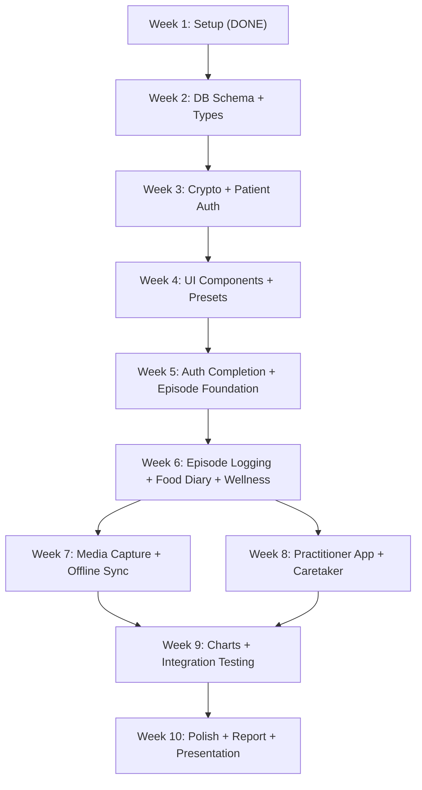

# ABStrack -- 10-Week Internship Roadmap

## Schedule Constraints

- **Weeks 2-5 (March 23 - April 19):** Lighter workload -- school is concurrent, last day April 15
- **Weeks 6-9 (April 20 - May 17):** Heavier workload -- school is finished, full focus on project
- **Week 10 (May 18-24):** Polish, report writing, and presentation prep
- **End of May:** Online presentation at Student Research Network celebration

---

## Week 1: March 9-15 -- Project Setup (COMPLETE)

- [x] Decide tech stack (Nx monorepo, Next.js 16, Expo 54, Supabase, PowerSync)
- [x] Scaffold monorepo with all apps and shared packages
- [x] Write PRD ([docs/PRD.md](PRD.md))
- [x] Create development roadmap

---

## Week 2: March 23-29 -- Database Schema and Shared Types

**Goal:** Stand up the Supabase backend and define the data contracts that every app and package depends on.

**Tasks:**

- [ ] Create Supabase project and configure environment variables
- [ ] Design and apply database migrations for all tables: `profiles`, `episodes`, `episode_symptoms`, `health_markers`, `food_diary_entries`, `preset_symptoms`, `preset_health_markers`, `practitioner_access`, `caretaker_access`, `episode_media`
- [ ] Write RLS policies for all tables (user-only, caretaker, practitioner read)
- [ ] Create the private `episode-media` storage bucket with RLS
- [ ] Implement `@abstrack/types` -- all shared TypeScript interfaces and enums (episode types, meal tags, symptom response types, user roles, etc.)
- [ ] Implement `@abstrack/supabase` -- Supabase client factory, auth helpers, typed query wrappers

**Why this week:** Foundation work with no UI to build or test -- ideal while school is busy. Everything downstream depends on the schema and types being correct.

---

## Week 3: March 30 - April 5 -- Crypto Package and Patient Authentication

**Goal:** Implement the encryption layer and basic patient auth so that all future data flows through the encryption pipeline.

**Tasks:**

- [ ] Implement `@abstrack/crypto`:
  - `encryptField` / `decryptField` (AES-256-GCM with random IV)
  - KEK derivation from password (Argon2id via `argon2id` npm package for browser, `@sphereon/react-native-argon2` for RN)
  - DEK generation, wrapping (encrypt DEK with KEK), and unwrapping
  - Platform abstraction: Web Crypto API for browsers, `react-native-quick-crypto` for React Native
- [ ] Patient sign-up flow: registration -> DEK generation -> KEK derivation -> wrapped DEK stored in Supabase
- [ ] Patient login flow: password -> KEK derivation -> DEK unwrap -> session DEK held in memory
- [ ] Persistent session via Supabase Auth refresh tokens
- [ ] Password reset flow: email link -> new password -> re-derive KEK -> re-wrap DEK
- [ ] Unit tests for crypto package (encrypt/decrypt round-trip, key wrapping)

**Why this week:** Crypto is the backbone of the entire app. Getting this right early avoids costly rework later. Still mostly backend/library code with minimal UI.

---

## Week 4: April 6-12 -- Shared UI Components and Preset Management

**Goal:** Build the reusable component library and the first user-facing feature (presets).

**Tasks:**

- [ ] Implement core `@abstrack/ui` components: accessible buttons, form inputs, cards, modal dialogs, navigation shell -- designed for impaired-user accessibility (large touch targets, high contrast)
- [ ] App layout and navigation for user web app ([apps/web](../apps/web)) and mobile app ([apps/mobile](../apps/mobile))
- [ ] Symptom preset CRUD screens:
  - Create/edit/delete/reorder symptom presets
  - Configure response type per symptom (yes/no, severity, free text, photo, video)
  - Common ABS symptom suggestions list
- [ ] Health marker preset CRUD screens:
  - Add/remove health markers (BAC, glucose, BP, heart rate, weight, custom)
- [ ] All preset data encrypted via `@abstrack/crypto` before storage

**Why this week:** Presets are required before episode logging can be built. The UI work is moderate but the CRUD logic is straightforward.

---

## Week 5: April 13-19 -- Auth Completion and Episode Logging Foundation

**Goal:** Round out authentication for all roles and lay the groundwork for the core episode logging feature.

**First half (April 13-15, school ending):**

- [ ] TOTP setup flow for practitioners via Supabase Auth MFA API
- [ ] Custom access token hook (PL/pgSQL) to inject role into JWT claims
- [ ] RLS policy additions: `auth.jwt() ->> 'aal' = 'aal2'` check for practitioner tables
- [ ] Frontend MFA gating in practitioner app

**Second half (April 16-19, school finished):**

- [ ] "I'm having an episode" button on home screen
- [ ] Episode creation: select symptom preset, begin prompt flow
- [ ] Prompt flow skeleton: step through symptoms one at a time, render correct input type per symptom
- [ ] Episode data model wired to Supabase with encryption

**Why this week:** The first half wraps up auth (smaller, config-heavy tasks good for end-of-school). The second half pivots to the most important feature once school pressure lifts.

---

## Week 6: April 20-26 -- Episode Logging, Food Diary, and Wellness Logging

**Goal:** Complete all core daily-use features that patients and caretakers interact with.

**Tasks:**

- [ ] Complete episode prompt flow:
  - All symptom input types functioning (yes/no, severity 1-5, free text)
  - Health marker entry after symptoms
  - "Add additional symptoms/markers" free-text entry at end
  - Episode type selection (ABS / Other) with custom label
  - Episode notes
  - Episode end flow (records `ended_at` timestamp and duration)
- [ ] Impaired-user UI polish: large text, large buttons, minimal cognitive load, high contrast mode
- [ ] Food diary:
  - Standalone food entry from home screen
  - Food entry during episode prompt (at end of flow)
  - Free text note + meal tag (Breakfast/Lunch/Dinner/Snack/Other) + timestamp
  - Encrypted storage via `@abstrack/crypto`
- [ ] General wellness logging:
  - "How are you feeling" mood/wellness entry with optional notes
  - Ad-hoc symptom logging (without starting a full episode)
  - Ad-hoc health marker capture

---

## Week 7: April 27 - May 3 -- Media Capture and Offline Sync

**Goal:** Add video/photo capture to episode logging and enable offline-first mobile experience.

**Tasks:**

- [ ] Video capture (max 15 seconds, stop early option) within episode prompt flow
- [ ] Photo capture within episode prompt flow
- [ ] Immediate playback preview + re-record option
- [ ] Client-side media encryption (AES-256-GCM on the blob via `@abstrack/crypto`)
- [ ] Encrypted thumbnail generation
- [ ] Upload encrypted `.enc` blobs to Supabase Storage `episode-media` bucket
- [ ] Time-limited signed URLs (60s) for download + client-side decryption for playback
- [ ] Implement `@abstrack/powersync`:
  - PowerSync schema matching Supabase tables
  - Sync rules configuration
  - SQLCipher integration via `@powersync/op-sqlite` for encrypted local DB
- [ ] Offline media upload queue:
  - Encrypt + save to local device storage while offline
  - Metadata row in local SQLite (`uploaded: false`)
  - Background upload on connectivity restore

---

## Week 8: May 4-10 -- Practitioner App and Caretaker Features

**Goal:** Build the practitioner web app and caretaker account system -- the two multi-user access patterns.

**Tasks:**

- [ ] Caretaker account:
  - Patient creates caretaker from settings
  - Shared DEK flow: patient wraps their DEK for caretaker's password-derived key
  - Caretaker login: unwrap patient DEK, hold in session
  - Caretaker sees same home screen and can log episodes on patient's behalf
- [ ] Practitioner invitation flow:
  - Patient enters practitioner email -> invitation sent
  - Practitioner creates account with mandatory TOTP enrollment
  - X25519 key pair generation on practitioner signup (private key wrapped with practitioner's password)
  - Patient encrypts their DEK with practitioner's public key -> stored in `practitioner_access`
- [ ] Practitioner app ([apps/practitioner](../apps/practitioner)):
  - Dashboard: list of patients who have granted access
  - Patient detail view: episode history, symptom logs, health markers, food diary
  - Media viewer: download encrypted blob -> decrypt with patient DEK -> display
  - Observation notes on episodes and patient records
- [ ] Access revocation: delete `practitioner_access` / `caretaker_access` row

---

## Week 9: May 11-17 -- Charts, Graphs, and Integration Testing

**Goal:** Build all data visualizations and do a full integration testing pass across all apps.

**Tasks:**

- [ ] Charts and graphs (client-side decrypted data):
  - Episode frequency over time (daily/weekly/monthly bar chart)
  - BAC readings over time (line chart)
  - Blood glucose over time (line chart)
  - Symptom frequency (bar/horizontal bar chart)
  - Episode type breakdown -- ABS vs Other (pie/donut chart)
  - Food diary correlation timeline (episodes + food entries on shared axis)
- [ ] Chart sharing: user selects chart + filters + writes notes -> shares to practitioner
- [ ] Practitioner in-app notification for shared charts
- [ ] Charts available in both user app and practitioner app
- [ ] Integration testing:
  - Full episode logging flow end-to-end (create presets -> log episode -> view in history)
  - Caretaker logging on behalf of patient
  - Practitioner viewing patient data and leaving notes
  - Offline sync round-trip (mobile)
  - Media capture, encrypt, upload, decrypt, playback
- [ ] Bug fixes and edge cases from testing

---

## Week 10: May 18-24 -- Final Polish, Report, and Presentation

**Goal:** Ship a polished MVP, write the project report, and prepare the presentation for the Student Research Network celebration.

**Tasks:**

- [ ] Final UI polish: consistent styling, loading states, error handling, empty states
- [ ] Accessibility review: screen reader labels, color contrast, keyboard navigation
- [ ] Final bug fixes from end-to-end testing
- [ ] Write final project report:
  - Problem statement and motivation
  - Technical architecture and design decisions
  - Security model explanation (client-side encryption, key management)
  - Features implemented (with screenshots)
  - Challenges and lessons learned
  - Post-MVP roadmap
- [ ] Prepare presentation slides:
  - Overview of ABS and why the app exists
  - Live demo walkthrough plan
  - Architecture diagram
  - Security highlights
  - Key features showcase
- [ ] Write and rehearse demo script:
  - Patient sign-up and preset creation
  - Episode logging flow (show impaired-user UI)
  - Media capture
  - Caretaker logging on behalf of patient
  - Practitioner viewing data and charts
- [ ] Ensure demo environment is stable and seeded with realistic sample data

---

## Dependency Graph

## Risk Mitigation Notes

- **Crypto complexity:** Week 3 is dedicated entirely to crypto + basic auth. If crypto takes longer, it spills into the lighter first half of week 5 (before school ends), not into a heavy feature week.
- **PowerSync/SQLCipher integration:** Week 7 pairs media and offline sync together. If PowerSync setup proves difficult, media capture can function without offline sync (upload immediately when online) and offline can be deferred to week 9.
- **Practitioner X25519 key exchange:** This is the most complex crypto flow. It's scheduled in week 8 after all other crypto patterns are established. If it blocks, practitioner access can fall back to a simpler shared-secret approach for the demo.
- **Charts:** Scheduled in week 9 to allow maximum data to accumulate for realistic demos. If time is tight, food diary correlation (the most complex chart) can be cut.
- **Presentation prep:** A full week is reserved. The demo script should be drafted by mid-week 10 to allow rehearsal time.
