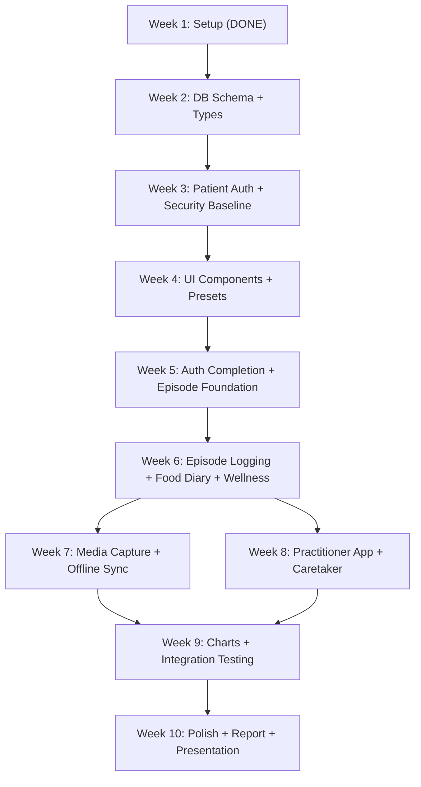

# ABStrack -- 10-Week Internship Roadmap

## Schedule Constraints

- **Weeks 2-5 (March 23 - April 19):** Lighter workload -- school is concurrent, last day April 15
- **Weeks 6-9 (April 20 - May 17):** Heavier workload -- school is finished, full focus on project
- **Week 10 (May 18-24):** Polish, report writing, and presentation prep
- **End of May:** Online presentation at Student Research Network celebration

---

## Week 1: March 9-15 -- Project Setup (COMPLETE)

- [x] Decide tech stack (Nx monorepo, Next.js 16, Expo 54, Supabase, PowerSync)
- [x] Scaffold monorepo with all apps and shared packages
- [x] Write PRD ([docs/PRD.md](PRD.md))
- [x] Create development roadmap

---

## Week 2: March 23-29 -- Database Schema and Shared Types

**Goal:** Stand up the Supabase backend and define the data contracts that every app and package depends on.

**Tasks:**

- [x] Create Supabase project and configure environment variables (project + Email provider in [Supabase dashboard](https://supabase.com/dashboard); vars documented in [`.env.example`](../.env.example))
- [x] Design and apply database migrations for all tables: `profiles`, `episodes`, `episode_symptoms`, `health_markers`, `food_diary_entries`, `preset_symptoms`, `preset_health_markers`, `practitioner_access`, `caretaker_access`, `episode_media`, `access_log` (append-only audit; no PHI in log rows)
- [x] Write RLS policies for all PHI tables (patient owns data; caretaker and practitioner per grant tables; practitioner MFA rules per [PRD](PRD.md))
- [x] Append-only `access_log`: privilege/RLS/trigger pattern so clients cannot forge or mutate log rows (trusted insert path only)
- [x] Create the private `episode-media` storage bucket with RLS on `storage.objects`
- [x] Implement `@abstrack/types` -- all shared TypeScript interfaces and enums (episode types, meal tags, symptom response types, user roles, etc.)
- [x] Implement `@abstrack/supabase` -- Supabase client factory, auth helpers, typed query wrappers

**Why this week:** Foundation work with no UI to build or test -- ideal while school is busy. Everything downstream depends on the schema and types being correct. PHI is stored as normal columns protected by RLS, TLS, and platform encryption at rest ([PRD](PRD.md)).

---

## Week 3: March 30-April 5 -- Patient Authentication and Security Baseline (COMPLETE)

**Goal:** Implement patient-facing auth and session behavior so all future data flows use Supabase Auth + RLS (no application-layer PHI encryption or per-user DEK in this model).

**Tasks:**

- [x] Patient sign-up and login: email/password via Supabase Auth
- [x] Persistent session via Supabase Auth refresh tokens (patient default: stays logged in); **optional patient preference** to require re-authentication when opening the app
- [x] Password reset via email link; password change does **not** re-encrypt PHI (server stores plaintext PHI under RLS per [PRD](PRD.md))
- [x] Wire **`healthCheckProfilesLimit1`** from `@abstrack/supabase` in **one** patient app (web or mobile) as part of validating sign-in/session: env keys, session, and RLS end-to-end
- [x] Document security baseline for the repo: TLS, RLS, grant tables (`practitioner_access`, `caretaker_access`), alignment with PRD security section

**Why this week:** Establishes auth without a client-side encryption key hierarchy. The product safeguards are RLS, grants, TLS, audit logging, and (later) SQLCipher on device—not field-level E2E crypto.

---

## Week 4: April 6-12 -- Shared UI Components and Preset Management (COMPLETE)

**Goal:** Build the reusable component library and the first user-facing feature (presets).

**Tasks:**

- [x] Implement core `@abstrack/ui` components: accessible buttons, form inputs, cards, modal dialogs, navigation shell -- designed for impaired-user accessibility (large touch targets, high contrast)
- [x] App layout and navigation for user web app ([apps/web](../apps/web)) and mobile app ([apps/mobile](../apps/mobile))
- [x] Symptom preset CRUD screens:
  - Create/edit/delete/reorder symptom presets
  - Configure response type per symptom (yes/no, severity, free text, photo, video)
  - Common ABS symptom suggestions list
- [x] Health marker preset CRUD screens:
  - Add/remove health markers (BAC, glucose, BP, heart rate, weight, custom)
- [x] Preset data persisted as normal rows/columns in Supabase, protected by RLS (same model as rest of PHI)

**Why this week:** Presets are required before episode logging can be built. The UI work is moderate but the CRUD logic is straightforward.

---

## Week 5: April 13-19 -- Auth Completion and Episode Logging Foundation

**Goal:** Round out authentication for all roles and lay the groundwork for the core episode logging feature.

**First half (April 13-15, school ending):**

- [x] TOTP setup flow for practitioners via Supabase Auth MFA API (mandatory for practitioners)
- [x] Practitioner MFA **fail-closed** per [PRD](PRD.md): RLS and/or **Edge Function** (or equivalent) verifies MFA via Auth APIs before patient-data reads; hooks alone must not be the sole control if they can fail open
- [x] JWT claims / role metadata for routing; practitioner patient-data access must satisfy MFA rules in policy or server path
- [x] Frontend MFA gating in practitioner app (no patient routes until MFA verified)

**Second half (April 16-19, school finished):**

- [x] Database: migrations for (1) `episodes.health_marker_preset_id` (nullable FK to `health_marker_presets`, same-owner pattern as `symptom_preset_id`) and (2) **episode preset templates** table—each template row **requires both** `symptom_preset_id` and `health_marker_preset_id` (NOT NULL; CASCADE if either preset is deleted) + RLS; regenerate `database.types.ts` and clients per [SUPABASE_CLOUD_DEVELOPER.md](SUPABASE_CLOUD_DEVELOPER.md). Template rows must exist **before** the episode-start template picker can list choices ([PRD](PRD.md) §4, [user story](user-stories/episode-and-health-marker-flows.md))
- [x] **Settings:** UI to create/edit **episode templates** (pair a symptom preset with a health marker preset under one name, e.g. ABS vs CVS)—done when the user is well, so episode start stays one-tap
- [ ] "I'm having an episode" button on home screen
- [ ] Episode start: user selects **one episode template** per session; insert episode with both `symptom_preset_id` and `health_marker_preset_id` resolved from that template ([user story](user-stories/episode-and-health-marker-flows.md))
- [ ] Prompt flow skeleton: step through symptoms one at a time, render correct input type per symptom
- [ ] Episode data wired to Supabase: plaintext columns under RLS (no client-side field encryption)

**Why this week:** The first half wraps up auth (config + server-mediated MFA verification). The second half lays episode logging foundation: schema for both preset IDs **and** templates, settings to define templates, then **I'm having an episode** → template picker → prompt skeleton.

---

## Week 6: April 20-26 -- Episode Logging, Food Diary, and Wellness Logging

**Goal:** Complete all core daily-use features that patients and caretakers interact with.

**Tasks:**

- [ ] Complete episode prompt flow:
  - All symptom input types functioning (yes/no, severity 1-5, free text)
  - Health marker entry **after** symptoms, using the **health marker preset** stored on the episode row (`health_marker_preset_id`) ([PRD](PRD.md) §4)
  - "Add additional symptoms/markers" free-text entry at end
  - Episode type selection (ABS / Other) with custom label
  - Episode notes
  - Episode end flow (records `ended_at` timestamp and duration)
- [ ] Impaired-user UI polish: large text, large buttons, minimal cognitive load, high contrast mode
- [ ] Food diary:
  - Standalone food entry from home screen
  - Food entry during episode prompt (at end of flow)
  - Free text note + meal tag (Breakfast/Lunch/Dinner/Snack/Other) + timestamp
  - Stored as plaintext in PostgreSQL under RLS (`food_diary_entries.food_note` per [PRD](PRD.md))
- [ ] General wellness: "How are you feeling" mood/wellness entry with optional notes
- [ ] Ad-hoc symptom logging without starting a full episode
- [ ] **Standalone vitals:** home or wellness entry to log health markers using **one health marker preset only** (asymptomatic; no symptom preset, no episode)—separate from episode flow ([PRD](PRD.md) §5, [user story](user-stories/episode-and-health-marker-flows.md))

---

## Week 7: April 27 - May 3 -- Media Capture and Offline Sync

**Goal:** Add video/photo capture to episode logging and enable offline-first mobile experience per the server-side safeguard + SQLCipher model.

**Tasks:**

- [ ] Video capture (max 15 seconds, stop early option) within episode prompt flow
- [ ] Photo capture within episode prompt flow
- [ ] Immediate playback preview + re-record option
- [ ] **Server-side confidentiality for media (not client DEK):** upload to private `episode-media` bucket; access via RLS on `storage.objects` and **time-limited signed URLs**; confidentiality from private bucket + RLS + TLS + platform at-rest encryption ([PRD](PRD.md) Section 10)
- [ ] Thumbnail object in same bucket as primary media (same access controls as primary file)
- [ ] Playback: obtain signed URL → download over TLS → display in `<video>` / `` or RN equivalents (**no** application-layer decrypt step for stored objects)
- [ ] Implement `@abstrack/powersync`:
  - PowerSync schema matching Supabase tables
  - **Sync Rules** (or Sync Streams) mirroring RLS grant logic (patient / caretaker / practitioner)—replication role uses BYPASSRLS; device download scope is defined by rules, not Postgres RLS on the sync connection ([PRD](PRD.md) Architecture)
  - SQLCipher integration via `@powersync/op-sqlite` for encrypted local SQLite
- [ ] Offline media upload queue:
  - While offline: write blob to local storage; **encrypt queued blobs with a device-bound key** (or store in SQLCipher) so raw video is not left unencrypted on disk if the device is compromised
  - Metadata row in local SQLite (`uploaded: false`); sync metadata to Postgres when online; background worker uploads to Storage then updates row

---

## Week 8: May 4-10 -- Practitioner App and Caretaker Features

**Goal:** Build the practitioner web app and caretaker account system using **grant tables + RLS** (no DEK sharing or asymmetric key exchange).

**Tasks:**

- [ ] Caretaker account:
  - Patient creates caretaker from settings (active `caretaker_access` grant)
  - Caretaker logs in with own credentials; access enforced by RLS on linked patient data—**no** wrapping or sharing a patient data encryption key ([PRD](PRD.md))
  - Caretaker sees same home screen and can log episodes on patient's behalf
- [ ] Practitioner invitation flow:
  - Patient enters practitioner email → invitation sent
  - Practitioner creates account with **mandatory** TOTP enrollment before accessing patient data
  - **No** X25519 or patient-DEK-to-practitioner-public-key flow; authorization is the `practitioner_access` grant + MFA + RLS
- [ ] Practitioner app ([apps/practitioner](../apps/practitioner)):
  - Dashboard: list of patients who have granted access
  - Patient detail view: episode history, symptom logs, health markers, food diary
  - Media viewer: signed URL → download → display (same confidentiality model as user app)
  - Observation notes on episodes and patient records
- [ ] Access revocation: delete or revoke `practitioner_access` / `caretaker_access` row (stops future reads; does not erase already-seen data)

---

## Week 9: May 11-17 -- Charts, Graphs, and Integration Testing

**Goal:** Build data visualizations using **server-side aggregation** and run full integration testing across all apps.

**Tasks:**

- [ ] Charts and graphs per [PRD](PRD.md) Section 9:
  - Aggregations computed in PostgreSQL (RPCs with `SECURITY INVOKER`, views under caller JWT, or Edge Function)—**do not** download full histories to aggregate in the browser
  - Episode frequency over time (daily/weekly/monthly)
  - BAC and blood glucose over time (line charts)
  - Symptom frequency; episode type breakdown (ABS vs Other)
  - Food diary correlation timeline
- [ ] Chart sharing: user selects chart + filters + notes → shares to practitioner
- [ ] Practitioner in-app notification for shared charts
- [ ] Charts in both user app and practitioner app (render server-prepared series only)
- [ ] Integration testing:
  - Full episode logging flow end-to-end (create presets → log episode → view in history)
  - Caretaker logging on behalf of patient (grant + RLS)
  - Practitioner viewing patient data and notes (grant + MFA + RLS)
  - Offline sync round-trip (mobile); media queue upload
  - Media: capture → upload to Storage → signed URL playback (no client DEK round-trip for stored objects)
- [ ] Bug fixes and edge cases from testing

---

## Week 10: May 18-24 -- Final Polish, Report, and Presentation

**Goal:** Ship a polished MVP, write the project report, and prepare the presentation for the Student Research Network celebration.

**Tasks:**

- [ ] Final UI polish: consistent styling, loading states, error handling, empty states
- [ ] Accessibility review: screen reader labels, color contrast, keyboard navigation
- [ ] Final bug fixes from end-to-end testing
- [ ] Write final project report:
  - Problem statement and motivation
  - Technical architecture and design decisions
  - Security model: RLS, grant tables, TLS, platform encryption at rest, SQLCipher on mobile, PowerSync Sync Rules aligned with RLS, practitioner MFA fail-closed, append-only audit log ([PRD](PRD.md))
  - Features implemented (with screenshots)
  - Challenges and lessons learned
  - Post-MVP roadmap
- [ ] Prepare presentation slides:
  - Overview of ABS and why the app exists
  - Live demo walkthrough plan
  - Architecture diagram
  - Security highlights (aligned with PRD)
  - Key features showcase
- [ ] Write and rehearse demo script:
  - Patient sign-up and preset creation
  - Episode logging flow (show impaired-user UI)
  - Media capture
  - Caretaker logging on behalf of patient
  - Practitioner viewing data and charts
- [ ] Ensure demo environment is stable and seeded with realistic sample data

---

## Dependency Graph

## Notes (constraints, not scope cuts)

- **Episode + health marker presets:** Week 5 ships migrations for `episodes.health_marker_preset_id`, the **episode preset templates** table, template **settings** UI, and **I'm having an episode** → template picker → insert with both preset IDs. Week 6 completes the full prompt flow (symptoms + markers), wellness, and standalone vitals—see week checkboxes and [user story](user-stories/episode-and-health-marker-flows.md).
- **PowerSync + RLS consistency:** Sync Rules must mirror grant logic (patient / caretaker / practitioner). Treat RLS as authoritative for API access; validate rule changes in tests ([PRD](PRD.md) Architecture). Week 7 delivers online media upload and the offline queue + PowerSync work as listed in that week’s tasks.
- **Practitioner MFA fail-closed:** Use an Edge Function (or equivalent) that verifies MFA before returning patient data; do not rely on JWT hooks alone if they can omit claims. This is part of Week 5’s practitioner MFA work, not a downgrade path.
- **SQLCipher / offline queue:** Week 7 pairs media and offline sync. Device-bound encryption for queued blobs matches the PRD; it is separate from server-side PHI encryption and does not involve sharing keys between users.
- **Charts:** Week 9 includes server-side aggregation for all charts in that week’s task list, including food diary correlation—no client-side download of full histories for aggregation.
- **Presentation prep:** Week 10 reserves time for polish, report, and presentation; draft the demo script by mid-week 10 so rehearsal is on schedule.
